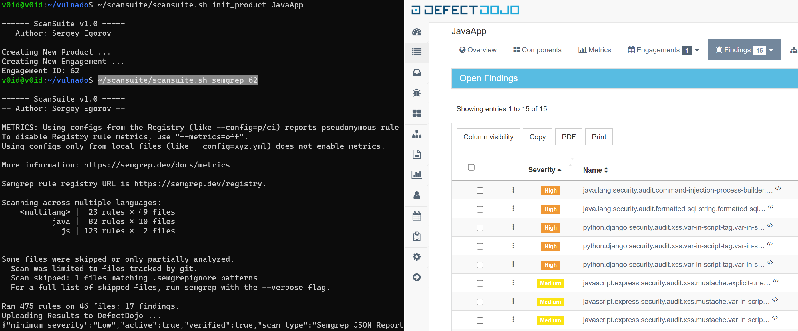

### Static and Dynamic Security Analysis with ScanSuite 

ScanSuite is the self contained bash wrapper around the open source code (SAST), Infrastructure as Code (IACS), Docker image, Containers and dependency (SCA) as well as dynamic analysis (DAST) tools.

Results are exported to [DefectDojo](https://github.com/DefectDojo/django-DefectDojo) (fill in the IP and api key inside the script). Ensure you have it installed. 

Docker is also required here as many of the tools used are dockerised, others will be kindly installed by the script as you call them (tested on Ubuntu).

Script works well for standalone checks or as a part of CI/CD pipeline. Here is the one of many implementation ways [Practical DevSecOps. Challenges of implementation.](https://github.com/cepxeo/presentations/blob/master/Practical_DevSecOps.pdf)



#### Create a new Product in DefectDojo

```
scansuite.sh init_product <App Name>
Example: ~/scansuite.sh init_product SomeCoolApp
```

Once created, take a note of `Engagement ID`. You'll need to provide it during the scans.

#### SAST scanners:

Start the scan from the source code folder.

```
cd SomeCoolApp
scansuite.sh <scanner name> <Engagement id> 
```
Here the `scanner name` is the keyword. Choose from the one of the following:

* semgrep     - C#, Go, Java, JavaScript, JSX, JSON, Python, Ruby, TypeScript, TSX
* python      - Bandit Python code scan
* eslint      - ESLint JavaScript and React scan.
* php         - PHP CS security-audit
* net         - .NET Security Code Scan
* nodejs      - NodeJsScan
* go          - Gosec Go scan
* ruby        - Brakeman Ruby scan
* mobsf       - Android/ Kotlin
* cscan       - Flawfinder C/C++
* spotbugs    - SpotBugs Java, Kotlin, Groovy, Scala code scan. Works with Ant, Gradle, Maven, and SBT build systems.
* secrets     - Checking for hardcoded passwords, API keys etc
* gitleaks    - Detecting passwords, api keys, and tokens in git repos

```
Example: ~/scansuite.sh semgrep 3
```

#### Dependency checks:

Start the scan from the source code folder.

```
cd SomeCoolApp
scansuite.sh <scanner name> <Engagement id> 
```

* gemnasium   - Supports [many languages](https://docs.gitlab.com/ee/user/application_security/dependency_scanning/)
* gemnasium_python - Checks Python dependencies in requirements.txt file
* retire      - Retire JS checks NodeJS/ npm dependencies.
* dep_trivy   - Trivy dependency checks.
* dep_owasp   - OWASP Dependency Check. Supports lots of languages.

#### DAST scan:

```
scansuite.sh <scanner name> <Engagement id> <URL>

Example: ~/scansuite.sh zap_full 3 https://ginandjuice.shop
```

* zap_base     - ZAP quick baseline scan.
* zap_full     - ZAP full scan.
* arachni      - Arachni 1.5
* arachni_new  - Arachni 1.5
* nikto        - Nikto
* dastardly    - PortSwigger Dastardly. Results are not exported due to not supported by DefectDojo.
* nuclei       - Nuclei
* wpscan       - WordPress Scanner
* sslyze       - SSL checks. Example: ~/scansuite.sh sslyze 3 google.com:443

#### IACS (Infrastructure as Code) scan:

Start the scan from the source code folder.

```
cd SomeCoolApp
scansuite.sh iacs_kics <Engagement id> 
```

* iacs_kics - Checkmarx KICS scanner for Ansible, AWS CloudFormation, Kubernetes, Terraform, Docker
* iacs_trivy - Trivy checks for config files and dependencies.

Once the scan is performed and uploaded to DefectDojo, login there and check the results.

#### Docker image checks:

[Trivy](https://github.com/aquasecurity/trivy) Docker image scan. Requires the image name with the tag.

```
Example: ~/scansuite.sh image_trivy 3 vulnerables/web-dvwa:latest                  
```

#### CIS Docker Benchmarks checks:

[Docker Bench for Security](https://github.com/docker/docker-bench-security) Docker Benchmarks checks.

```
Example: ~/scansuite.sh scansuite.sh docker_bench 3              
```

### Manual interaction with DefectDojo

Optionally one can interact with DefectDojo directly using the commands below.

#### Adding manual findings to DefectDojo

Add the new test to an engagement:

```
scansuite.sh add_test <Engagement id> <Test name>
```

Add the new finding to the test:

```
scansuite.sh add_finding <Test id> <Finding name> <Severity> <Description> <Mitigation>

Example:
scansuite.sh add_finding 368 "Sensitive data exposure" Medium "/api/application.wadl is accessible" "Delete the file ot restrict an access to it"
```

#### Creating additional engagement for the product:

Take a note of "id" of the product. It's in the URL when browsing the product. 
Create a new Engagement within the Product:

```
scansuite.sh init_engage <Product id>        
Example: ~/scansuite.sh init_engage 2
```

#### Upload arbitrary report to DefectDojo

Supported report formats could be found [Here](https://defectdojo.github.io/django-DefectDojo/integrations/parsers/)

```
scansuite.sh export_report <Engagement id> <Test type in DefectDojo> <filename>
./scansuite.sh export_report 1 "OpenVAS CSV" openvas-test.csv
```